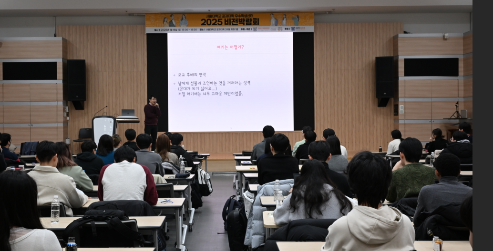
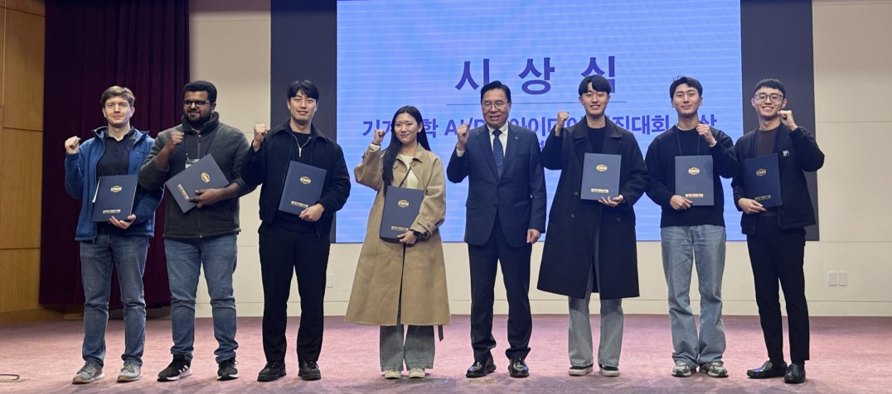
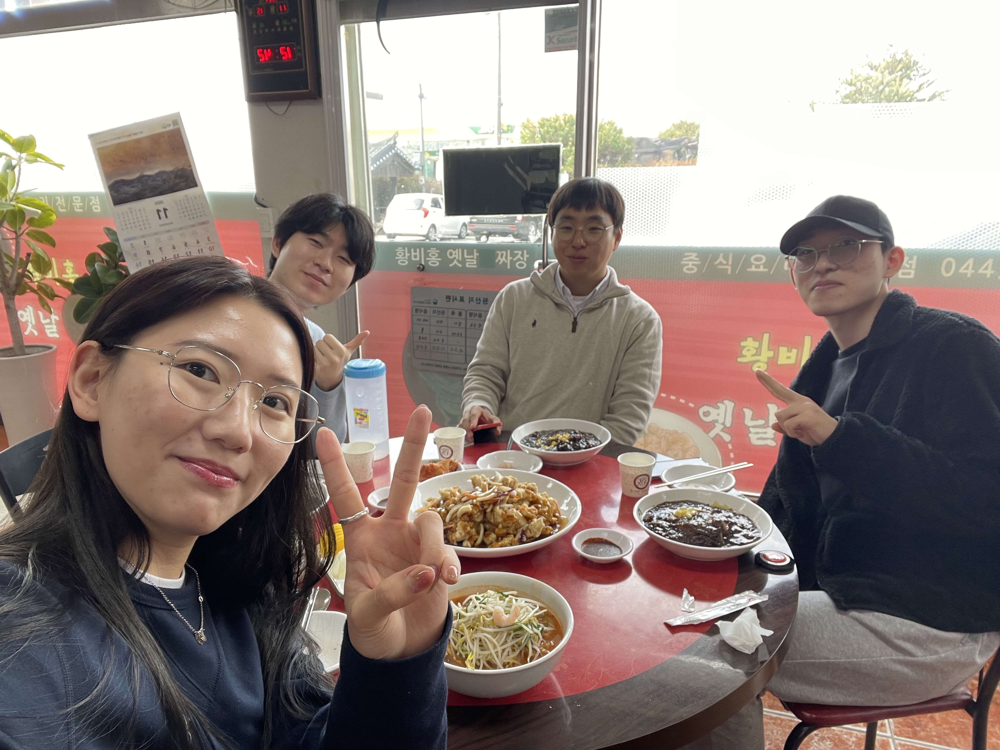
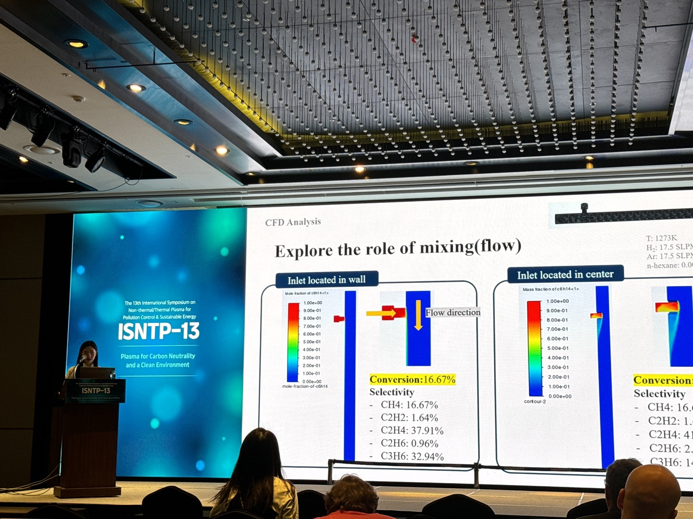
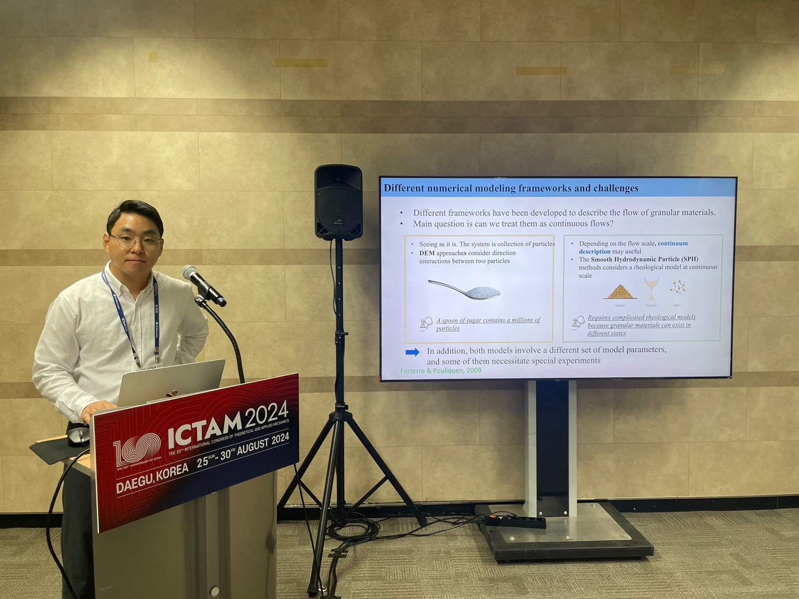
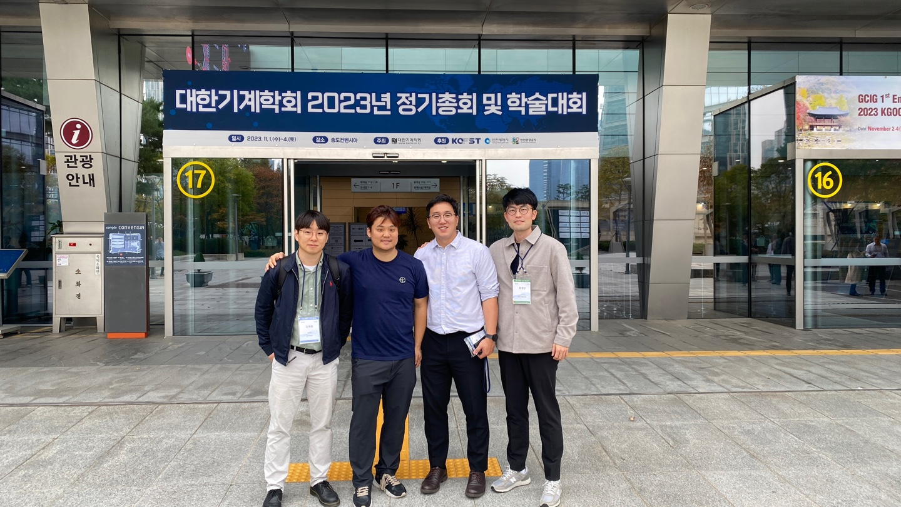

# Photos

## 서울대학교 비전 박람회 
**2025. 01. 17.**  

## Group Award! 
**2024. 11. 21**    
  

Subin and Jihun won the Encouragement Award at the AI/DX Competition hosted by the Korea Institute of Machinery and Materials.  

## Group Lunch 
**2024. 11. 14**  

## Conference 
**2024. 11. 06**  

  

Subin presented at the 13th International Symposium on Non-thermal/Thermal Plasma for Pollution Control & Sustainable Energy.  
Congratulations on her academic debut!

## Conference 
**2024. 08.28**  

  

Prof. Kim gave a talk in International Congress of Theoretical and Applied Mechanics at Daegue in 2024. 

## Conference 
**2023. 11.04**  

  

대한기계학회(KSME) at Songdo, Incheon, November 2023. 
  
